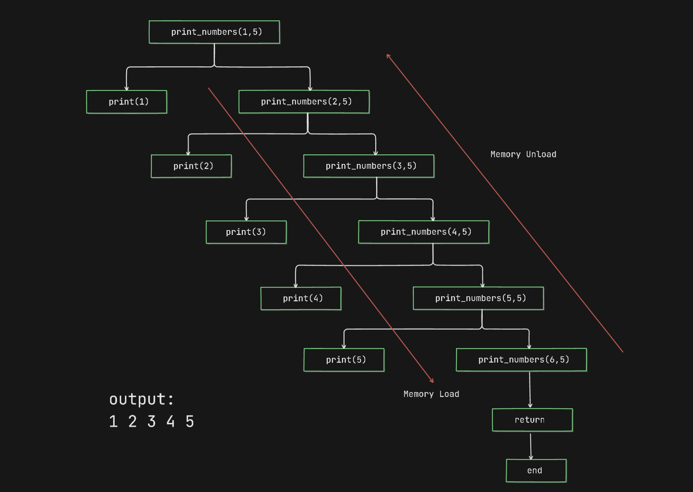

# Recursion in Python
Recursion is a programming technique where a function calls itself to solve smaller instances of a problem until it reaches a base case, in other words recursion is a function that calls intself with a exit base case.

## Key Components of Recursion
1. **Base Case:** The condition under which the function stops calling itself.

2. **Recursive Case:** The part where the function calls itself with a smaller or simpler input.

## Flow Diagram of a Recursion


## Examples with Flow Diagram

### Example 1: Print numbers
```python []
def print_numbers(lower, upper):
    # Base case
    if lower > upper:
        return # when true, exit code
    
    print(lower)
    print_numbers(lower+1, upper)


print_numbers(1, 5) # output: 1 2 3 4 5
```


> Memory load and memory unload is also known as winding and unwinding

### Example 2: Factorial
```python []
def factorial(n):
    if n <= 1:
        return 1
    
    return n * factorial(n-1)

n = 5 # input: n = 5
print(factorial(n)) , # output: 120 (5! = 120)
```

### Example 3: Print Pattern
```python []
def print_pattern(n, current=1):
    if current > n:
        return
    print('*' * current)
    print_pattern(n, current + 1)

print_pattern(5)

'''
# Output:

*
**
***
****
*****
'''
```

## Types of Recursion
1. **Direct Recursion:** Function calls itself directly.
2. **Indirect Recursion:** Function A calls B, and B calls A (with a helper function).
3. **Head Recursion:** Head recursion is when a function calls itself before doing any processing.
4. **Tail Recursion:** Recursive call is the last operation in the function (can be optimized in some languages).
5. **Tree Recursion:** Function makes multiple recursive calls (e.g., Fibonacci).

### Head vs. Tail Recursion

| Feature        | Head Recursion                           | Tail Recursion                                        |
| -------------- | ---------------------------------------- | ----------------------------------------------------- |
| Order of Call  | Recursive call **before** processing     | Recursive call **after** processing                   |
| Execution Flow | Builds up call stack first               | Can be optimized to a loop (TCO)                      |
| Stack Usage    | Generally more memory usage              | More efficient if tail call optimization is available |
| Use Case       | Problems where post-processing is needed | Problems where results accumulate during the call     |


## Common Pitfalls
- **Missing Base Case:** Leads to infinite recursion → RecursionError.
- **Improper Recursive Step:** Might not reach the base case.

## Recursion vs Iteration
| Feature      | Recursion                        | Iteration               |
| ------------ | -------------------------------- | ----------------------- |
| Structure    | Function calls itself            | Uses loops (for, while) |
| Memory usage | More (stack frames)              | Less                    |
| Speed        | Often slower                     | Often faster            |
| Readability  | More elegant (for some problems) | Can be more efficient   |

## When to Use Recursion?
- Tree traversals (e.g., binary trees)
- Divide and conquer algorithms (e.g., mergesort, quicksort)
- Problems with naturally recursive structure (e.g., Fibonacci numbers, permutations)